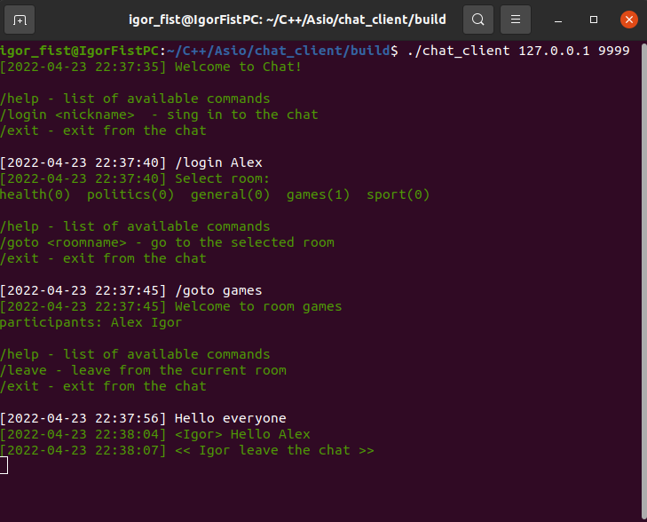

# Chat client project
This repo is client for [Chat server](https://github.com/IgorFist/Chat_server).

For chat starting needed:

*  run chat_client and specify host address and port

```
$ ./chat_client 127.0.0.1 9999
``` 
* choose username that is not use
  
* select room

